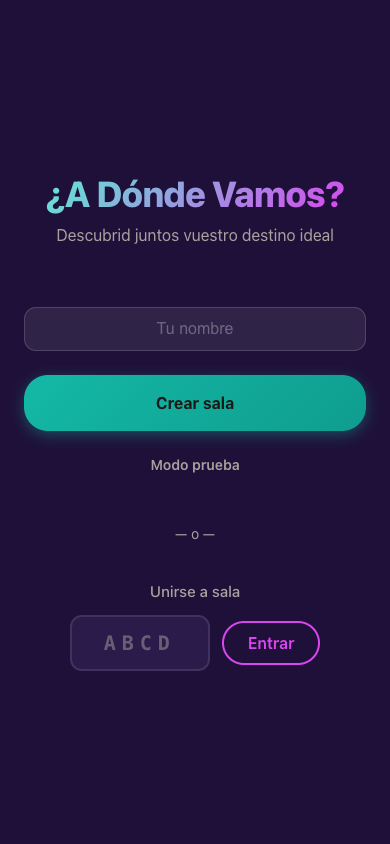
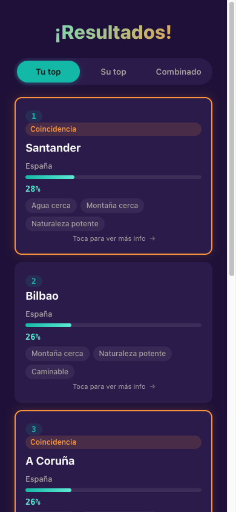

# A Donde Vamos?

Real-time 2-player travel destination picker game. Play 3 blind mini-games together and discover your ideal long-weekend destination.

Built with vanilla HTML/CSS/JS + Node.js WebSocket server. No frameworks, no database.

## Screenshots

<p align="center">
  
  
  
</p>

<p align="center">
  
  
</p>

## How it works

Two players connect from their phones (same WiFi) and play 3 mini-games **without seeing each other's answers**:

1. **Test Emocional** (5 quick questions) - Pick images/vibes that attract you
2. **Lo Importante** (3+3 picks) - Choose 3 must-haves and 3 deal-breakers
3. **Tus Prioridades** (sliders 1-5) - Rate the importance of each travel category

A scoring algorithm compares both players' preferences against 16 European cities and reveals the best matches, coincidences, and a combined ranking.

## 16 Cities

Bilbao, A Coruna, Santander, Palma de Mallorca, Menorca, Nantes, Toulouse, Paris, Estrasburgo, Bolonia, Turin, Ginebra, Praga, Sofia (and more).

Each city has a weighted tag profile across 10 dimensions: water, mountains, nature, gastronomy, walkability, tranquility, landscapes, authenticity, uniqueness, and easy excursions.

## Tech Stack

- **Frontend**: Vanilla HTML5, CSS3 (custom properties, animations, mobile-first), ES modules
- **Backend**: Node.js HTTP server + WebSocket (`ws` library)
- **Real-time sync**: Server-owned timers, room-based multiplayer with 4-character codes
- **Solo mode**: Bot player with random answers for testing
- **QR codes**: Client-side generation via CDN library for easy phone-to-phone joining

## Getting Started

```bash
npm install
npm start
```

Open `http://localhost:3000` on two devices connected to the same network.

For solo testing, click "Modo prueba" to play against a bot.

## Project Structure

```
a-donde-vamos/
  server.js          # WebSocket server, game logic, scoring engine
  package.json
  public/
    index.html       # Single-page app (9 screens + 2 overlays)
    styles.css       # Mobile-first CSS with tropical color palette
    app.js           # Client logic (ES module)
    data.js          # Shared game data (cities, tags, questions, options)
  docs/
    screenshots/     # App screenshots
```

## Scoring Algorithm

1. Each mini-game builds a preference vector across 10 tags
2. City tags are normalized (0-2 to 0-1 range)
3. Similarity: `score = sum(pref_i * tag_i) / (sum(pref_i) + epsilon)`
4. Weighted combination: 30% emotional test + 40% important/no-want + 30% sliders
5. "No quiero" penalties reduce scores for cities matching deal-breakers (max 15%)
6. Combined score averages both players' individual scores

## Features

- Mobile-first dark UI with tropical color palette (turquoise, fuchsia, mango)
- Real-time WebSocket sync with server-owned timers
- Instruction screens before each mini-game
- +10s timer extension (once per question in MG1)
- Search/filter in MG2 options
- 3-tab results view (your top, partner's top, combined)
- Coincidence detection and highlighting
- Share results via WhatsApp / clipboard
- Rematch support
- 60-second disconnection/reconnection handling
- All UI text in Spanish
